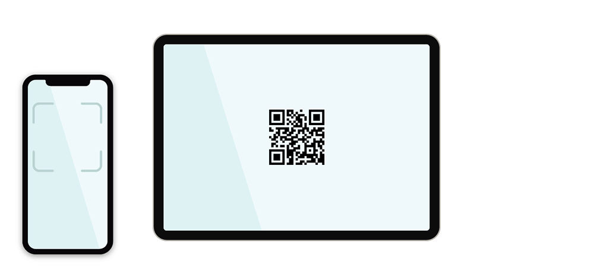
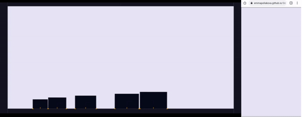
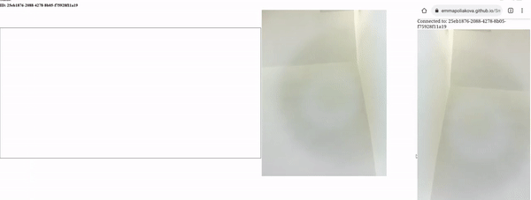

# WebRTC Smartphone Controller #

## About ##
Smartphones are ubiquitous, incredibly optimized and cost-effective devices. They have more computing power than a Raspberry Pi, are reliably connected to the internet and include a lot of sensors. This projects aims to turn smartphone into smart controllers for interactive experiments. The original idea was to only use video from phone camera but it soon showed that many other kinds of controllers could be developed. 

## Tools ##
The main tool to make a peer-to-peer connection is [Peerjs](https://peerjs.com/), [WebRTC](https://webrtc.org/).
To generate QRcodes with custom Urls [Qrcodejs](https://davidshimjs.github.io/qrcodejs/) was used.
Other tools to create the demos themselves are [Matterjs](https://brm.io/matter-js/) for physics simulation, [Nipplejs](https://yoannmoi.net/nipplejs/) joystick and [Handpose](https://github.com/tensorflow/tfjs-models/tree/master/handpose) for handtracking. 

## How it works ##

The whole process requires only 2 steps:

### 1. Open the website ###
Navigate to the PC side website. This will create a peer listening for connection and show a QRcode with a unique ID. 

### 2. Scan the QRcode ###
Scan the QRcode with your smartphone. Two websites communicate by eastablishing peer to peer connection. The QRcode will provide all necessary details for the phone to connect to the PC.

### 3. Control the website ###
After opening the QRcode URL you are ready to use your smartphone as a controller. No extra installation required. The smartphone will send data from the controller to the PC browser which will process them and turns them into real actions.

## Demos ##

[Tiny platformer](https://codeincomplete.com/articles/tiny-platformer/) game with NES controller. Collect the gold coins and jump on the enemies to beat the level. Try the [tiny platformer](https://emmapoliakova.github.io/SmartphoneLeapMotion/demo/tinyPlatformer/index.html)

[3D racing](https://frankforce.com/how-i-made-a-3d-game-in-only-2k-of-javascript/) game controlled with phone joystick. Use the joystick to steer, brake and jump. How many points can you score before the time runs out? Try the [3D Racer](https://emmapoliakova.github.io/SmartphoneLeapMotion/demo/3dRacing.html)

A physics simulator created with Matterjs. Use the touchpad to select and stack blocks. Try the [physics simulator](https://emmapoliakova.github.io/SmartphoneLeapMotion/physics/physicsDemoV3.html)

Multiplayer tower building. This demo requires two people to connect. Both players will need to cooperate by selecting the same block to be able to carry it. Try the [cooperative physics simulator](https://emmapoliakova.github.io/SmartphoneLeapMotion/physics/physicsDemoV4.html)

This demo lets you stream a video into browers that will track your hand to control the ball. Try the [hand tracking](https://emmapoliakova.github.io/SmartphoneLeapMotion/handtracking/receiveVideo.html)

## Future plans ## 
I am currently working on developing an open source library that will offer tools to create an easy peer connection and process the incoming data. Another plan is to expand the range of controller types offered.  

