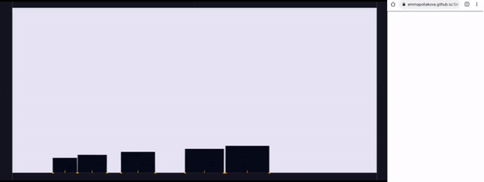
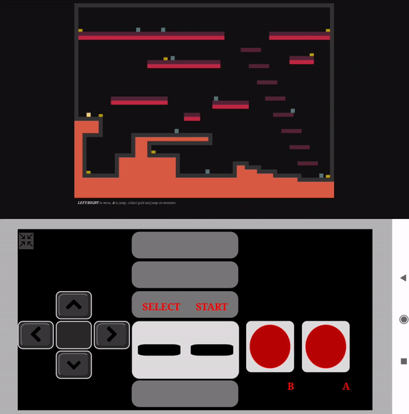

Hand tracking (25/06/21): https://emmapoliakova.github.io/SmartphoneLeapMotion/handtracking/receiveVideo.html

Touch screen - 1 phone (29/06/21): https://emmapoliakova.github.io/SmartphoneLeapMotion/receiveScreen.html

Touch screen - 2 phones (02/07/21): https://emmapoliakova.github.io/SmartphoneLeapMotion/receiveMultiple.html

Touch screen tower building with physics engine (04/07/21): https://emmapoliakova.github.io/SmartphoneLeapMotion/physics/physicsDemo.html

Touch screen tower building with physics engine - version 2, refactored (13/07/21): https://emmapoliakova.github.io/SmartphoneLeapMotion/physics/physicsDemoV2.html

Touch screen 3D racing game canvas/joystick (07/07/21): https://emmapoliakova.github.io/SmartphoneLeapMotion/demo/3dRacing.html

Touch screen platformer(18/07/21): https://emmapoliakova.github.io/SmartphoneLeapMotion/demo/tinyPlatformer/index.html

Using Matterjs to create a world with stacking blocks and a canvas on the phone to move the blocks around. Try the [physics simulator]( https://emmapoliakova.github.io/SmartphoneLeapMotion/physics/physicsDemoV3.html)

Tiny platformer game with NES controller. Try the [tiny platformer](https://emmapoliakova.github.io/SmartphoneLeapMotion/demo/tinyPlatformer/index.html)

